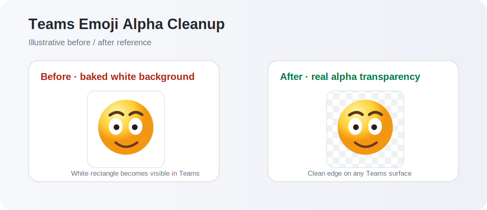
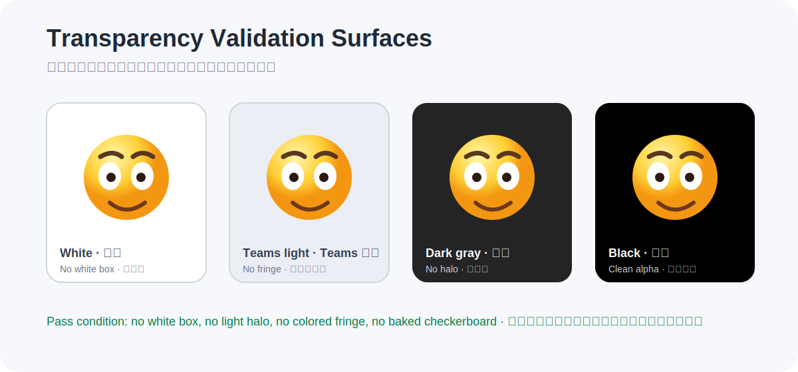

# Teams Emoji Alpha Cleanup Skill

[English](README.md) · [中文](README.zh-CN.md)

## Purpose

This repository contains one formal Skill for converting an existing emoji, sticker, avatar, icon, or simple illustration into a **Microsoft Teams-ready custom emoji**.

It is a source-image editing workflow. It preserves the original subject instead of redrawing or creatively reinterpreting it.

**Target output:** a verified 256 × 256 lossless WEBP with real RGBA alpha, clean anti-aliased edges, preserved internal white details, and no white box or halo.

## Preview

### Before → After

A file can look transparent locally but still display a white rectangle in Teams. This workflow removes only the exterior-connected background while preserving intended white details inside the emoji.



### Validation backgrounds

A Teams-ready emoji should remain clean on light and dark surfaces. No white box, white halo, colored fringe, or checkerboard pattern should be visible.



## One formal Skill, plus an optional Prompt Pack

The repository intentionally has one formal Skill:

- [`SKILL.md`](SKILL.md): source-image cleanup, technical validation, and Teams asset export.

It also includes one optional creative resource:

- [`prompts/teams-emoji-creator-prompts.md`](prompts/teams-emoji-creator-prompts.md): a lightweight prompt pack for creating original workplace reaction-emoji concepts.

The Prompt Pack is not a second formal Skill. Image-generation tools can already create original concepts from natural language. The pack helps colleagues start with clearer prompts and keep a consistent visual direction.

A generated concept is not automatically a Teams-ready file. Download the selected source image and run it through `SKILL.md` before treating it as a final Teams asset.

## Choose the right path

| Situation | Recommended path | Reliability |
|---|---|---|
| Create a new emoji concept | Use the optional [Prompt Pack](prompts/teams-emoji-creator-prompts.md) | Good for creative exploration only |
| Preserve an existing emoji exactly and remove its background | Use [`SKILL.md`](SKILL.md) with the original image | Required for source-faithful cleanup |
| Mainly use ChatGPT, Claude, or another chat model | Upload the original image and `SKILL.md`, then follow the [ChatGPT / Claude Guide](docs/CHATGPT_CLAUDE_GUIDE.en.md) | Limited until a downloadable file is verified |
| Run Python locally | Use the included helper script | High for flat or nearly flat backgrounds |
| Use Codex or another file-capable agent | Provide the source image and `SKILL.md`, then require technical verification | High when validation checks are performed |

> A GitHub link alone is not proof that a chat model has read the Skill. Do not accept a newly generated illustration, a chat preview, or a checkerboard mockup as a Teams-ready file.

## ChatGPT and Claude users

Read the [ChatGPT / Claude Guide](docs/CHATGPT_CLAUDE_GUIDE.en.md) before testing in a chat-only environment.

The guide explains how to upload the original image and `SKILL.md`, run a preflight check before any generation, recognize false-success signals, and reject a result that is not a downloadable, verifiable WebP file.

## Quick start

```bash
git clone https://github.com/JMok999/teams-emoji-alpha-cleanup-skill.git
cd teams-emoji-alpha-cleanup-skill
python -m pip install -r requirements.txt
python scripts/clean_teams_emoji.py input.jpg input_teams_emoji_256.webp
```

The helper accepts static raster images readable by Pillow, including JPG, PNG, WEBP, BMP, TIFF, and the first frame of GIF files.

### Optional parameters

```bash
python scripts/clean_teams_emoji.py INPUT_IMAGE OUTPUT.webp \
  --size 256 \
  --padding 0.10 \
  --tolerance 34 \
  --edge-softness 0.55
```

| Option | Default | Meaning |
|---|---:|---|
| `--size` | `256` | Final square canvas size. Teams output is fixed at 256 × 256. |
| `--padding` | `0.10` | Transparent margin. Recommended range: 0.08 to 0.12. |
| `--tolerance` | `34` | Exterior-background matching tolerance. |
| `--edge-softness` | `0.55` | Alpha-edge smoothing amount. |

## Output standard

| Item | Standard |
|---|---|
| Format | Lossless WEBP |
| Canvas | Exactly 256 × 256 px |
| Transparency | Real RGBA alpha channel |
| Padding | About 8–12% transparent margin |
| Subject | Complete, centered, and not redrawn |
| Edge quality | Smooth, decontaminated, with no white or gray halo |
| Validation | `#FFFFFF`, `#ECEEF6`, `#242424`, and `#000000` |

## Workflow

1. Inspect the source and select flat-background segmentation, semantic segmentation, or manual masking.
2. Remove only exterior background connected to the image edge.
3. Preserve enclosed white details such as eye whites, gloss, teeth, and logos.
4. Build a clean alpha matte and decontaminate partially transparent edges.
5. Fit the full subject into a 256 × 256 canvas with safe padding.
6. Verify the actual exported file and inspect validation previews.

## Project layout

```text
teams-emoji-alpha-cleanup-skill/
├─ README.md
├─ README.zh-CN.md
├─ SKILL.md
├─ requirements.txt
├─ docs/
│  ├─ CHATGPT_CLAUDE_GUIDE.en.md
│  ├─ CHATGPT_CLAUDE_GUIDE.md
│  └─ images/
│     ├─ before-after-teams.svg
│     └─ validation-backgrounds.svg
├─ prompts/
│  └─ teams-emoji-creator-prompts.md
└─ scripts/
   └─ clean_teams_emoji.py
```

## Source of truth

`SKILL.md` is the authoritative execution contract for agents. It contains dependencies, supported inputs, default parameters, source-access checks, fallback rules, filename derivation, and mandatory technical acceptance checks.

## Limitations

- The reference helper is optimized for flat or nearly flat backgrounds.
- Complex photographic scenes, hair, fur, glass, smoke, or translucent materials need semantic segmentation or manual mask refinement.
- A tool that cannot produce and verify a genuine transparent WEBP must not claim the output is Teams-ready.
- A chat preview is not proof of a real transparent file.

## License

No license file is included yet. Add a license before redistributing or accepting outside contributions.
